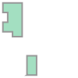
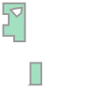

Filtering Data
==============

Spatial Filters
---------------

``nvcl-kit`` allows you to filter boreholes based on a polygon geometry. This is particularly useful when you
want to focus on a specific area of interest. You can use any polygon geometry, such as a shapefile, geojson,
or even a manually created polygon using the Shapely library.

Start by loading your Shapefile using the :func:`geopandas.read_file` method. The shapefile
should contain a polygon geometry that will be used to filter the boreholes.

.. code-block:: python

    import geopandas as gpd

    # Load the shapefile. This could also be a geojson file or any other format supported by Geopandas
    gdf = gpd.read_file("polygon.shp")

    # Check the coordinate reference system (CRS) of the shapefile
    print(gdf.crs)

Next, import the necessary modules and initialise the :class:`~nvcl_kit.reader.NVCLReader`. You can pass the
polygon geometry as a parameter to :func:`~nvcl_kit.param_builder`. The reader will then use this polygon to 
filter the boreholes and only return those that exist within the polygon. The ``polygon`` parameter supports
both :class:`shapely.Polygon` and :class:`shapely.MultiPolygon` geometries.

.. code-block:: python

    # Import the necessary modules
    import pandas as pd
    from nvcl_kit.generators import gen_summary_dataframe
    from nvcl_kit.param_builder import param_builder
    from nvcl_kit.reader import NVCLReader

    # Initialise NVCL reader and filter using the first geometry in the GeoDataFrame
    param = param_builder("NSW", polygon=gdf.geometry[0])
    reader = NVCLReader(param)
    if not reader.wfs:
        print("Error: Cannot contact service")

By default the reader will assume that a polygon is provided in `EPSG:4326 <https://epsg.io/4326>`_. If your polygon uses a different
Coordinate Reference System (CRS), make sure to specify the correct SRID using ``polygon_srid`` when building the parameters.

.. code-block:: python

    # Initialise NVCL reader with polygon in a different CRS (e.g., EPSG:3857)
    param = param_builder("NSW", polygon=gdf.geometry[0], polygon_srid=3857)
    reader = NVCLReader(param)
    if not reader.wfs:
        print("Error: Cannot contact service")

If your polygon contains interior rings (holes), you can ask nvcl-kit to remove them by setting the ``remove_rings``
parameter to ``True`` when building the parameters. This will ensure that the filter only considers the exterior boundary
of the polygon(s).

.. code-block:: python

    # Initialise NVCL reader with option to remove interior rings from the polygon
    param = param_builder("NSW", polygon=gdf.geometry[0], polygon_srid=gdf.crs.to_epsg(), remove_rings=True)
    reader = NVCLReader(param)
    if not reader.wfs:
        print("Error: Cannot contact service")

   MultiPolygon with interior rings removed prior to filtering.

   MultiPolygon with interior rings (holes).