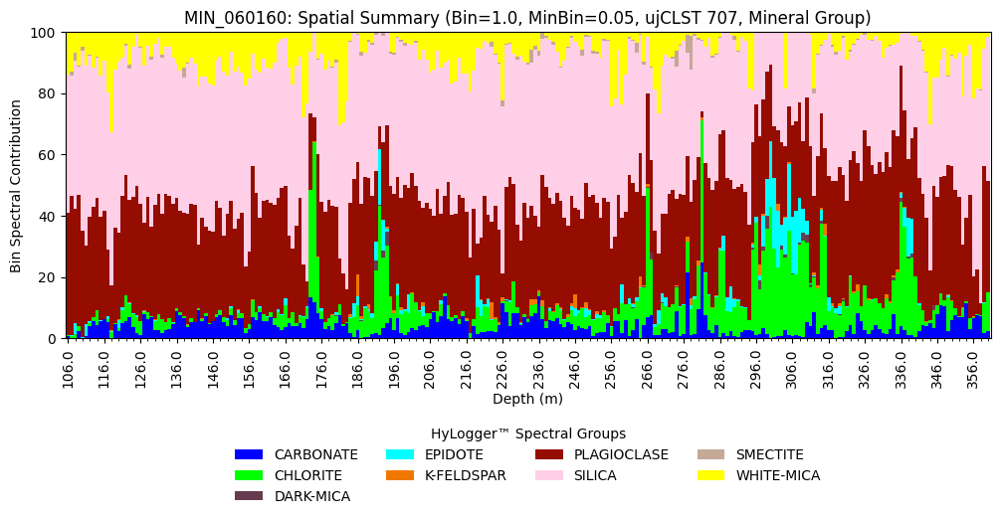

Summary Data
============

Generate Summary Data
---------------------

Let's start by importing the necessary modules and initialising the NVCL reader.

.. code-block:: python

    # Import the necessary modules
    import pandas as pd
    from nvcl_kit.generators import gen_summary_dataframe
    from nvcl_kit.param_builder import param_builder
    from nvcl_kit.reader import NVCLReader

    # Initialise NVCL reader
    param = param_builder("NSW")
    reader = NVCLReader(param)
    if not reader.wfs:
        print("Error: Cannot contact service")

Now we can generate a summary dataframe for a single borehole. The dataframe will
contain the percentage of each mineral group in each 1m depth bin. The metadata will
contain information about the borehole and the parameters used to generate the dataframe.

.. code-block:: python

    boreholeid = "MIN_060160"
    bin_size = 1.0
    min_item_pct = 0.05
    scalar_set = "ujCLST"
    scalar_level="group"
    meta, df = next(gen_summary_dataframe(reader=reader, nvcl_id_list=[boreholeid], scalar_set=scalar_set, scalar_level=scalar_level, resolution=bin_size, min_item_pct=0.05), None)

If you want to save the summary dataframe to a CSV file you can do so using the following code:

.. code-block:: python

    df.to_csv(f"summary.csv", index=False)

Plot Summary Data
-----------------

Following on from the above example we can create a summary plot similar to what you will find in The Spectral Geologist™ software.

.. code-block:: python

    from matplotlib.ticker import MultipleLocator

    # Generate the summary data and then plot it 
    meta, df = next(gen_summary_dataframe(reader=reader, nvcl_id_list=[boreholeid], scalar_set=scalar_set, scalar_level="group", start_depth="floor", weighted=True, resolution=bin_size, min_item_pct=min_item_pct, continue_on_missing=True), None)

    # Create a colour map using the colour values from the metadata classifications
    colors = {c[0]: c[1]["colour"] for c in meta["classifications"].items()}

    # Create the summary plot
    ax = df.plot.bar(x="StartDepth", y=df.columns[3:], stacked=True, figsize=(12,4), width=1.0, color=colors, ylim=(0,100))
    ax.legend(title="HyLogger™ Spectral Groups", loc="upper center", bbox_to_anchor=(0.5, -0.25), ncol=4, frameon=False)
    ax.set_title(f"{boreholeid}: Spatial Summary (Bin={bin_size}, MinBin={min_item_pct}, {scalar_set} {meta['scalar_algorithm_version']}, Mineral Group)")
    ax.set_ylabel("Bin Spectral Contribution")
    ax.set_xlabel("Depth (m)")
    ax.axes.xaxis.set_major_locator(MultipleLocator(10))
    ax.axes.xaxis.set_minor_locator(MultipleLocator(2))

